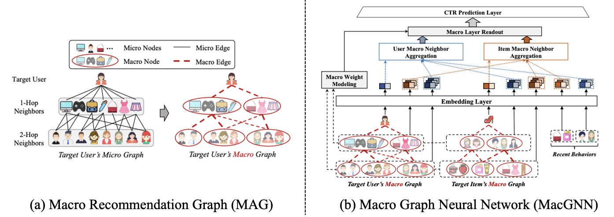

# MacGNN
This is the source code demo repository of MacGNN ([Macro Graph Neural Networks for Online Billion-Scale Recommender Systems](https://arxiv.org/pdf/2401.14939.pdf)), The Web Conference 2024.

## Introduction
Predicting Click-Through Rate (CTR) in billion-scale recommender systems has long been a challenging task for Graph Neural Networks (GNNs) due to the immense computational complexity involved in aggregating billions of neighbors. In order to address this issue, GNN-based CTR models typically resort to sampling a few hundred neighbors out of the billions to enable efficient online recommendations. However, this approach introduces a severe sampling bias, resulting in the failure to capture the full range of user or item behavioral patterns. 
To overcome this challenge, we propose a new approach by introducing the concept of a "micro recommendation graph" for conventional user-item recommendation graphs, and we present a more suitable alternative called the **<u>MA</u>cro Recommendation <u>G</u>raph (MAG)** for billion-scale recommendations. The MAG approach resolves the computational complexity problems in the underlying infrastructure by reducing the node count from billions to hundreds. Specifically, MAG groups micro nodes (users and items) with similar behavior patterns together to form macro nodes. Subsequently, we introduce tailored **Macro Graph Neural Networks (MacGNN)** to aggregate information on a macro level and refine the embeddings of macro neighbors. 




## Requirements
```
python >= 3.8
torch  == 1.11.0
pickle == 0.7.5
scikit-learn == 1.1.1
pandas == 1.4.1
numpy == 1.21.2
tqdm == 4.63.0
```

## Environment
The offline experiments are conducted on the Linux system with NVIDIA Tesla M40 (24G) GPUs under the CUDA version of 10.2.

## Dataset Access
We have provided the preprocessed datasets for direct usage. Due to the datasets being too large to be directly uploaded (exceeds git's file size upload limitation), we store the preprocessed datasets in Google Cloud Disk, the access links are as follows: https://drive.google.com/drive/folders/1xJ8HpEya7Kyndh2yA2WIdnnTLejbsZWe?usp=sharing

After the **data.zip** file is downloaded from the link, you should unzip it and place the unzipped datasets (files with .pkl suffix) into the **./data** folder.

Furthermore, we have also provided the data processing code in the **./data/MAG** folder. Thus, you can also download the raw data that we used or any of your other recommendation datasets and process it by yourself. 

Here are the sources of the public datasets that we used in the paper:
* MovieLens dataset: https://grouplens.org/datasets/movielens/10m
* Electronics dataset: https://jmcauley.ucsd.edu/data/amazon
* Kuaishou dataset: https://kuairec.com

## Experiment Reproduce
We provide all the running scripts to reproduce our experimental results. Note you should place the downloaded datasets into the **./data** folder and enter the **./model** folder before running the code.

Firstly, we provide an overall running script file **reproduce.sh** in ./model folder, which can run directly in bash.
```
bash reproduce.sh
```

Furthermore, you can also implement and reproduce the result of each dataset that we provided directly as follows.

* For **MovieLens**, you can use the following run command:
```
python main.py --model_name macgnn --dataset_name ml-10m --learning_rate 0.01 --weight_decay 5e-5 --runs 5 --tau 1.9
```

* For **Electronics**, you can use the following run command:
```
python main.py --model_name macgnn --dataset_name elec --learning_rate 0.01 --weight_decay 1e-5 --runs 5 --tau 0.6
```

* For **Kuaishou**, you can use the following run command:
```
python main.py --model_name macgnn --dataset_name kuairec --learning_rate 0.005 --weight_decay 1e-5 --runs 5 --tau 0.7
```

## Citation
```
@inproceedings{chen2024macro,
  title={Macro Graph Neural Networks for Online Billion-Scale Recommender Systems},
  author={Chen, Hao and Bei, Yuanchen and Shen, Qijie and Xu, Yue and Zhou, Sheng and Huang, Wenbing and Huang, Feiran and Wang, Senzhang and Huang, Xiao},
  booktitle={Proceedings of the ACM Web Conference},
  year={2024}
}
```
